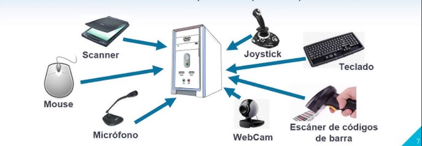
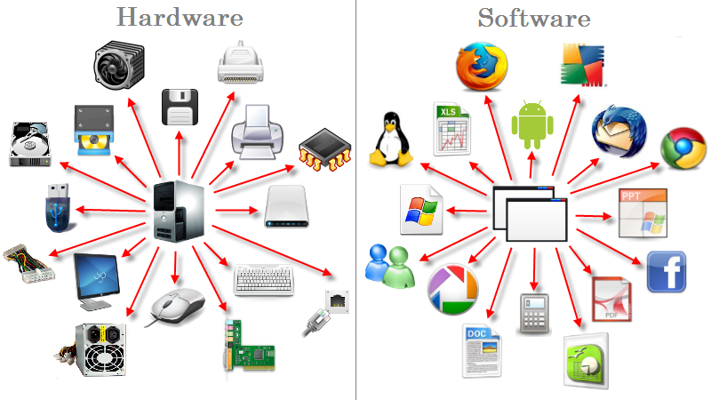
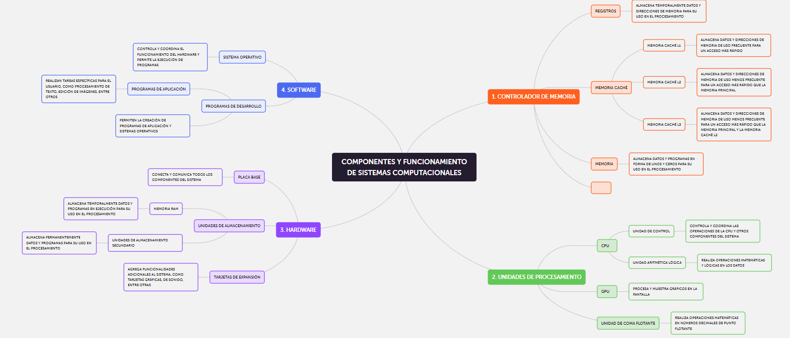

## 1.¿Qué es un computador?
Un computador es una máquina capaz de procesar información de manera automática. Está diseñado para realizar operaciones lógicas, almacenar datos y ejecutar programas o instrucciones para llevar a cabo tareas específicas. Un computador consta de componentes de hardware y software, trabajando de manera conjunta.

Tomado y adaptado de:
["Computación, Arquitectura de Computadores", de William Stallings. Pearson Educación](http://biblioteca.univalle.edu.ni/files/original/c1b1f5d1c12abc60a246e2a0d784f7c9d163ee81.pdf)

## 2.Arquitecturas de un computador 
La arquitectura de un computador es la estructura y diseño de sus componentes principales, que incluyen tanto el hardware como los circuitos necesarios para su funcionamiento. Determina cómo los componentes interactúan entre sí y cómo los programas pueden aprovechar estos recursos para ejecutar instrucciones.

###  2.1 Arquitectura CISC (Complex Instruction Set Computer)
En esta arquitectura, la CPU tiene un conjunto amplio y complejo de instrucciones. Esto permite que la CPU ejecute operaciones complejas en una sola instrucción, lo que puede simplificar el diseño del software, pero al mismo tiempo aumenta la complejidad del hardware.

__Ejemplos de equipos modernos:__

Procesadores Intel x86 AMD Ryzen

## 2.2 Arquitectura RISC (Reduced Instruction Set Computer)
En esta arquitectura, la CPU tiene un conjunto reducido de instrucciones, lo que simplifica el diseño de la CPU. Las instrucciones son más simples y se ejecutan en menos ciclos de reloj, lo que mejora la eficiencia y velocidad en algunos casos.

__Ejemplos de equipos modernos:__

Procesadores ARM (utilizados en dispositivos móviles y sistemas embebidos)

Tomado y adaptado de:
["Computación, Arquitectura de Computadores", de William Stallings. Pearson Educación](http://biblioteca.univalle.edu.ni/files/original/c1b1f5d1c12abc60a246e2a0d784f7c9d163ee81.pdf)

## 3. ¿Qué es el hardware?
El hardware es la parte física de un computador, que incluye todos los componentes y dispositivos que realizan el procesamiento de datos y permiten la interacción con el 
usuario.

### 3.1 CPU (Unidad Central de Procesamiento)
La CPU es el cerebro del computador, encargada de ejecutar las instrucciones de los programas. Está formada por varias partes esenciales:

- __ALU__ (Unidad Aritmético Lógica): Realiza operaciones matemáticas y lógicas.
- __Unidad de Control__: Dirige la ejecución de las instrucciones y coordina las demás unidades del computador.
- __Registros__: Memoria pequeña y rápida que guarda datos temporales y resultados intermedios de operaciones.
- __Buses__: Canales de comunicación que permiten el traslado de datos entre los distintos componentes del sistema.
- __Memoria caché__: Almacena los datos que el usuario consulta con frecuencia, lo que aumenta la velocidad del procesador. 
- __Núcleo__: Es la unidad base que interpreta y ejecuta acciones. 
- __Controlador de memoria__: Es un circuito que regula el flujo de datos entre el procesador y la memoria. 
- __Reloj__: Determina la velocidad de trabajo de los elementos internos de la CPU.

### 3.2 GPU (Unidad de Procesamiento Gráfico)
La GPU es un procesador que se encarga de manejar los graficos en la manipulación y la creación de imágenes, efectos y vídeos, es principalmente utilizado en renderizado y juegos.

Algunas de sus partes son:
- __Núcleo (CUDA Cores)__: Son los procesadores que realizan los cálculos paralelos, esenciales para el rendimiento gráfico.

- __Memoria VRAM__: Almacena datos gráficos (como texturas) y permite un acceso rápido a estos datos durante el renderizado.

- __Bus de memoria__: Canal que conecta la memoria VRAM con el resto de la GPU, influyendo en la velocidad de acceso a los datos.

- __Unidad de procesamiento gráfico (GPU Core)__: Organiza y controla las operaciones de procesamiento gráfico, como la renderización de imágenes.

- __Salidas de video__: Son los conectores (HDMI, DisplayPort) que permiten conectar la GPU a la pantalla.

- __Sistema de refrigeración__: Ventiladores y disipadores para evitar el sobrecalentamiento de la GPU durante su uso.

Tomado y adaptado de: [Apen30 soluciones informaticas](https://apen.es/glosario-de-informatica/hardware/)
    

## 4. ¿Qué es el software?
El software es el conjunto de instrucciones y programas que le indican al hardware qué hacer. Se clasifica en diferentes tipos:

### 4.1 Software de Sistema
Es el conjunto de programas que gestionan el hardware y permiten la ejecución de otros programas. Ejemplo: el sistema operativo (Windows, Linux, macOS).

### 4.2 Software de Aplicación
Son programas diseñados para realizar tareas específicas, como procesadores de texto, hojas de cálculo, navegadores web, etc.

### 4.3 Software de Desarrollo
Son herramientas que permiten a los desarrolladores escribir, probar y mantener otros programas. Ejemplo: compiladores, editores de código, entornos de desarrollo integrados (IDE).

Tomado y adaptado de: [CISET](https://www.ciset.es/glosario/480-software-concepto-y-tipos)

## 5. Funcionamiento del computador

### 5.1 ¿Qué procesos se llevan a cabo cuando se enciende una computadora?
- __Encendido__: Se suministra energía a la computadora.
- __POST__: El sistema verifica que los componentes básicos (CPU, RAM, etc.) estén funcionando.
- __BIOS/UEFI__: Se inicia el firmware que prepara el hardware para arrancar el sistema.
- __Búsqueda del dispositivo de arranque__: El BIOS/UEFI encuentra el disco con el sistema operativo.
Cargador de arranque: Se carga el cargador que inicia el sistema operativo.
- __Carga del Sistema Operativo__: El kernel del sistema operativo se carga y empieza a configurar los servicios.
- __Pantalla de inicio de sesión__: El sistema muestra la interfaz para que el usuario inicie sesión.

### 5.2 ¿Qué sucede desde que ingreso un dato a través del teclado, hasta que veo el resultado de la operación en la pantalla?
Cuando ingresas un dato a través del teclado, el proceso es el siguiente:

El teclado envía señales eléctricas a la CPU.
La CPU procesa los datos e interpreta las instrucciones del sistema operativo.
El resultado se almacena en la memoria RAM o se muestra en la pantalla a través de la GPU.
### 5.3 ¿Cómo se codifican los datos internamente en el computador?
Los datos se codifican en forma de bits (0s y 1s) dentro de la memoria. Todo tipo de datos (texto, imágenes, audio) se convierten a secuencias de bits mediante un sistema de codificación.

### 5.4 ¿Cuáles son las unidades de medida de datos en un computador?
Las unidades más comunes de medida de datos son:
| UNIDAD  |TAMAÑO|
|------------|------|
|Bit|0-1|
|Byte|8 Bits|
|Kilobyte|1024 KB|
|Megabyte|1024 MB|
|Gigabyte|1024 GB|
|Terabyte|1024 TB|

Tomado y adaptado de: [IBM](https://www.ibm.com/docs/es/aix/7.2?topic=startup-boot-process&utm_source=chatgpt.com)

## Mapa conceptual  
