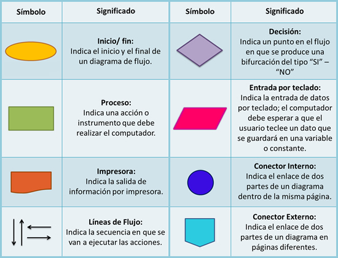
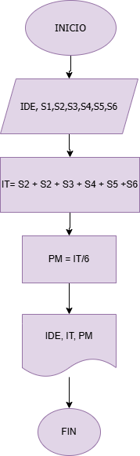
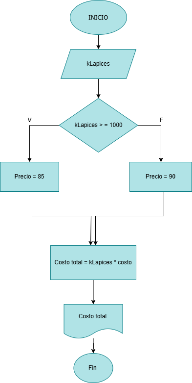
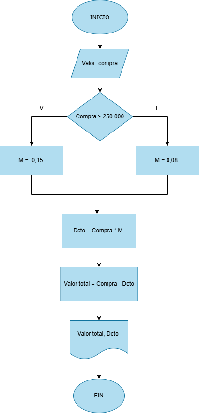
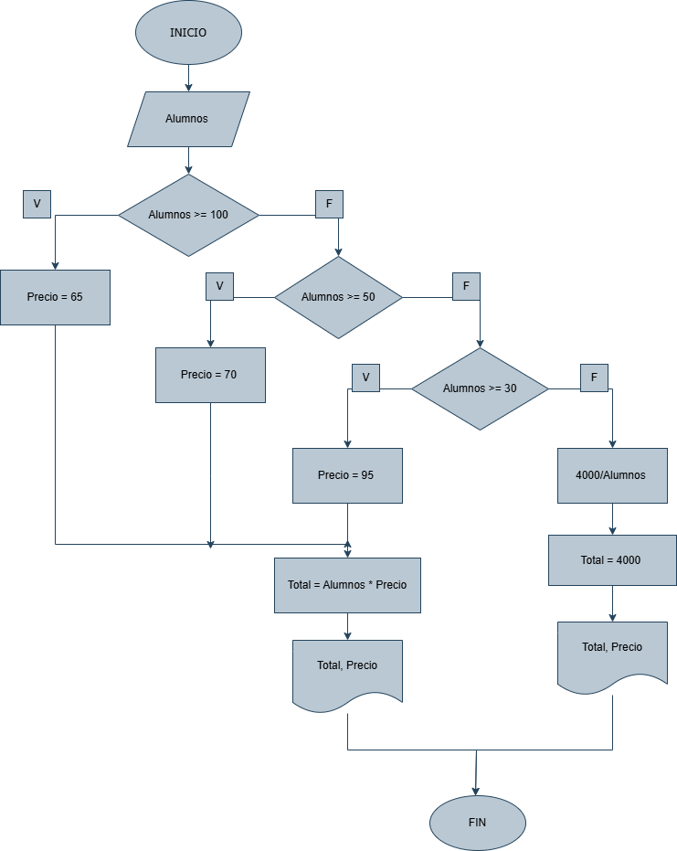

 ## Símbolos que se utilizan para representar cada operación de un  algorimo con un diagrama de flujo

 

 ## Ejercicio 1 

- Construye un algoritmo que, al recibir como datos el ID del empleado y los seis primeros sueldos del año, calcule el ingreso total semestral y el promedio mensual, e imprima el ID del empleado, el ingreso total y el promedio mensual.



## Ejercicio 2 
Realice un algoritmo para determinar cuánto se debe pagar por equis cantidad de lápices considerando que si son 1000 o más el costo es de $85 cada uno; de lo contrario, el precio es de $90. Represéntelo con el pseudocódigo y el diagrama de flujo.

```
Inicio
Leer kLapices
si kLapices > 1000
    Hacer Precio = 85
si no 
    Hacer Precio = 90 
Fin si
Hacer Costo total = klapices * Precio
Escribir "EL costo total es:" Costo total
Fin 
```



## Ejercicio 3

```
Inicio 
Leer Compra 
Si Compra > 250.000 
    Hacer M = 0.15
Si no 
    Hacer M = 0.08
Fin si
Dcto = Compra * M
Valor total = Compra - Dcto 
Escribir "El valor total de la compra es:" Valor total
Escribir "El descuento fue de:" Dcto 
Fin 
```
Un almacén de ropa tiene una promoción: por compras superiores a $250 000 se les aplicará un descuento de 15%, de caso contrario, sólo se aplicará un 8% de descuento. Realice un algoritmo para determinar el precio final que debe pagar una persona por comprar en dicho almacén y de cuánto es el descuento que obtendrá. Represéntelo mediante el pseudocódigo y el diagrama de flujo.



## Ejercicio 4


El director de una escuela está organizando un viaje de estudios, y requiere determinar cuánto debe cobrar a cada alumno y cuánto debe pagar a la compañía de viajes por el servicio. La forma de cobrar es la siguiente: si son 100 alumnos o más, el costo por cada alumno es de $65.00; de 50 a 99 alumnos, el costo es de $70.00, de 30 a 49, de $95.00, y si son menos de 30, el costo de la renta del autobús es de $4000.00, sin importar el número de alumnos.

```
Inicio 
Leer Alumnos
Si Alunmos >= 100
    Hacer Alumnos = 65
Si no 
    Hacer = 

```



## Parte 1: Identificar Algoritmos

Responde si los siguientes enunciados representan un algoritmo. Justifica la respuesta:

1. Una página web.

    __No respresenta un algoritmo__ ya que la página web es un conjunto de documentos, pero no siguen una secuencia lógica de pasos para resolver un problema.


2. Una receta para hacer un pastel, donde se indican ingredientes y pasos a seguir.

    __Si representa un algoritmo__ ya que la receta define un conjunto de pasos ordenados para llegar a un resultado final.


3. "Piensa en un número y multiplícalo por otro".

    __No es un algoritmo__, Aunque es una operación matemática, no es un proceso bien definido ni especifica qué hacer después del cálculo.

4. Un manual de instrucciones para armar un mueble, con  pasos detallados y un orden claro.

    __Si es un algoritmo__, presenta una serie de pasos bien definidos para lograr un objetivo específico.

5. Una lista de compras organizada en orden alfabético
    __No es un algoritmo__, solo es un conjunto de datos organizados, pero no describe una secuencia de pasos para resolver un problema.

## Parte 2: Variables y Constantes

Indica si las siguientes afirmaciones describen una variable o una constante:

1. El valor de la gravedad en la Tierra, 9.8 m/s².

    __Constante__ Su valor nunca cambia.


2. La edad de una persona calculada en base al año actual y su año de nacimiento.

    __Variable__ Cambia con el paso del tiempo, ya que la edad de una persona aumenta cada año.


3. La cantidad de dinero en una cuenta bancaria.

    __Variable__ Puede cambiar con depósitos y retiros.


4. La velocidad de la luz en el vacío, 299,792,458 m/s.

    __Constante__ Es un valor fijo en la física y no varía.

5. El radio de un círculo.

    __Variable__ Depende del tamaño del círculo y puede tomar diferentes valores.


## Parte 3: Características de los Algoritmos

Responde si los siguientes enunciados cumplen con las características de un algoritmo. Justifica la respuesta:

1. Para elegir la ruta más corta entre varias ciudades, el algoritmo examina rutas candidatas, deteniéndose cuando los 
cambios en la distancia parecen lo suficientemente pequeños.

    __Si es un algoritmo__ ya que un algoritmo es preciso y aqui nos presenta "parecen" lo que nos genera ambiguedad.


2. Suma los números ingresados y muestra el resultado.

    __Si es un algoritmo__ ya que nos indica lo que debemos hacer, y en el momento que dejemos de ingresar numeros obtendremos un resultado.


3. Un conjunto de pasos para calcular el área de un rectángulo dado su base y altura.

    __Si es un algoritmo__ ya que tiene sus entradas, procesos y salidas bien definidas.


4. __El algoritmo cuenta el número de votos obtenidos por cada uno de los candidatos de una elección para presidente. Empieza solicitando el nombre del candidato y finaliza cuando se ingresa el valor -1.__


## Parte 4: Comprensión de Herramientas

Indica si las siguientes afirmaciones son ciertas o falsas respecto al pseudocódigo y diagramas de flujo:

1. El pseudocódigo utiliza símbolos estándar para representar las operaciones lógicas.

    __Falso__, El pseudocódigo usa descripciones textuales para representar la lógica de un algoritmo, sin depender de símbolos gráficos como los diagramas de flujo.


2. Los diagramas de flujo son una representación gráfica de un algoritmo.

    __Verdadero__, utilizan símbolos estandarizados como óvalos (inicio/fin), rombos (decisiones) y rectángulos (procesos) para representar visualmente el flujo de un algoritmo.


3. El pseudocódigo debe estar escrito en un lenguaje de programación específico.

    __Falso__, El pseudocódigo es un lenguaje informal que describe la lógica de un algoritmo sin seguir la sintaxis estricta de un lenguaje de programación específico. 


4. Un diagrama de flujo siempre debe tener un inicio y un fin claramente definidos.

    __Verdadero__, Todo diagrama de flujo debe indicar dónde comienza y termina el proceso para que sea comprensible y completo.

## Parte 5: Estructuras de Control

Describe para qué sirven las estructuras de control. Redacta dos ejemplos, uno de tu vida diaria, es decir cuando tienes que tomar decisiones en tus actividades diarias y oto ejemplo en el que se tengan que utilizar cálculos matemáticos para tomar una u otra decisión.