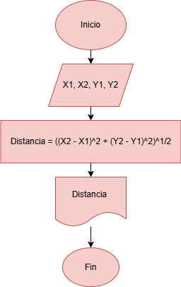
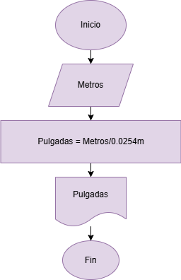
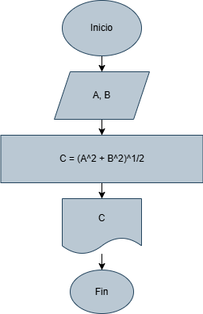

## Problemas 

### 1. Se requiere obtener la distancia entre dos puntos en el plano cartesiano, tal y como se muestra en la figura 1. Realice un diagrama de flujo y pseudocódigo que representen el algoritmo para obtener la distancia entre esos puntos.

__Analisís:__ 

    Variables de entrada: X1, X2, Y1, Y2
    Variables de salida: Distancia
    Constantes: N/A 
    Operaciones: Distancia = ((X2 - X1)^2 + (Y2 - Y1)^2)^1/2

    Inicio 
    Escribir "Punto en X1:"
    Escribir "Punto en X2:"
    Leer X1, X2
    Escribir "Punto en Y1:"
    Escribir "Punto en Y2:"
    Leer Y1, Y2
    Distancia = ((X2 - X1)^2 + (Y2 - Y1)^2)^1/2
    Imprimir Distacia 
    Fin 

### 2. Una modista, para realizar sus prendas de vestir, encarga las telas al extranjero. Para cada pedido, tiene que proporcionar las medidas de la tela en pulgadas, pero ella generalmente las tiene en metros. Realice un algoritmo para ayudar a resolver el problema, determinando cuántas pulgadas debe pedir con base en los metros que requiere. Represéntelo mediante un diagrama de flujo y pseudocódigo (1 pulgada = 0.0254 m).

__Analisís:__ 

    Variables de entrada: Metros 
    Variables de salida: Pulgadas
    Constantes: 0.0254m
    Operaciones: Pulgadas = Metros/0.0254m

    Inicio
    Escribir "Metros" 
    Leer metros 
    Pulgadas = Metros/0.0254m
    Imprimir Pulgadas 
    Fin 

### 3. Se requiere determinar la hipotenusa de un triángulo rectángulo. ¿Cómo sería el diagrama de flujo y el pseudocódigo que representen el algoritmo para obtenerla?  Recuerde que por Pitágoras se tiene que: $C^2 = A^2 + B^2$.

__Analisís:__ 

    Variables de entrada: A, B
    Variables de salida: C
    Constantes: N/A 
    Operaciones: C^2 = A^2 + B^2 

    Inicio
    Escribir "A"
    Escribir "B" 
    Leer A, B
    C = (A^2 + B^2)^1/2
    Imprimir C
    Fin 

### 4. Se requiere determinar la edad actual de una persona basándose en su fecha de nacimiento. Además, es necesario establecer si la persona ya ha cumplido años en el año en curso, si aún no lo ha hecho, o si hoy es su cumpleaños, para celebrarlo. La fecha de nacimiento y la fecha actual estarán representadas mediante tres variables: día, mes y año.
    
 **Instrucciones:**
    
- Diseñe un algoritmo que permita calcular la edad de la persona.
- Dentro de la solución, determine si la persona ya celebró su cumpleaños este año o si aún no lo ha hecho.
 - Verifique si la fecha actual corresponde al día de su cumpleaños. De ser así, imprima el mensaje “Feliz Cumpleaños”.
 - Represente la solución utilizando **pseudocódigo** claro y estructurado.

__Analisís:__ 

Variables de entrada: 
- DAC : Dia actual
- MAC : Mes actual 
- AAC : Año actual 
- DCU : Dia cumpleaños
- MCU : Mes cumpleaños
 - ACU : Año cumpleaños 
     
Variables de salida: Edad actual 

Constantes: N/A 

Operaciones: Edad = AAC - ACU

    Inicio 
    Escribir "Ingrese la fecha de nacimiento: (Dia/Mes/Año)"
    Escribir "Fecha actual:(Dia/Mes/Año)"

    Leer DAC, MAC, AAC, DCU, MCU, ACU

    Edad = AAC - ACU 
    Si MAC < MCU
        Edad =Edad - 1
    Sino Si MAC = MCU
        Si DAC < DCU
        Edad = Edad - 1
        Sino Si DAC = DCU 
        Imprimir "Feliz cumpleaños"
        Sino
            Imprimir "Ya has cumplido años este año"
        Fin si
    Sino
        Imprimir "Ya has cumplido años este año"
    Fin si
    Imprimir "Tu edad es:", Edad 
    Fin 
    

### 5. Realice un algoritmo que permita determinar el sueldo semanal de un trabajador con base en las horas trabajadas y el pago por hora, considerando que a partir de la hora número 41 y hasta la 45, cada hora se le paga el doble, de la hora 46 a la 50, el triple, y que trabajar más de 50 horas no está permitido. Represente el algoritmo mediante pseudocódigo.

__Analisís:__ 

Variables de entrada: NoHoras, Pagoxhora

Variables de salida: Sueldo

Constantes: N/A 

Operaciones: Sueldo = NoHoras * Aumento
   

    Inicio 
    Escribir "Numero de horas trabajadas"
    Escribir "Pago Por Hora"
    Leer NoHoras, PagoxHora
    Si NoHoras > 50
        Escribir "No está permitido"
        Aumento = PagoxHora * 3
    Sino Si Nohoras >= 46
        Aumento = PagoxHora * 3
        Sino Si NoHoras >= 41
            Aumento = PagoxHora * 2
            Sino 
            Aumento = PagoxHora 
        Fin si   
    Fin si
    Si NoHoras <= 50
        Imprimir  Sueldo = Nohoras * Aumento 
        Escribir "Su sueldo semanal es:"
    Fin si
    Fin 

### 6. Se requiere un algoritmo para determinar, de N cantidades, cuántas son cero, cuántas son menores a cero, y cuántas son mayores a cero. Realice el pseudocódigo para representarlo, utilizando el ciclo apropiado.

__Analisís:__ 

Variables de entrada: Numeros a ingresar

Variables de salida: Igual0, Menor0, Mayor0

Constantes: N/A 

Operaciones: Aumento,
            Igual0 = Igual0 + 1,
            Menor0 = Menor0 + 1,
            Mayor0 = Mayor0 + 1

    Inicio 
    Escribir "Ingrese la cantidad de numeros"
    Leer N

    Igual0 = 0
    Menor0 = 0
    Mayor0 = 0
    C = 0

    Mientras C < N
    Escribir "Ingrese un numero"
    Leer Nu
        Si Nu = 0
            Igual0 = Igual0 +1 
        Sino Si Nu < 0
            Menor0 = Menor0 + 1
        Sino 
            Mayor0 = Mayor0 + 1
        Fin si
        C = C + 1
    Fin mientras

    Escribir "Cantidad de ceros:", Igual0
    Escribir "Mayores que cero:", Mayor0
    Escribir "Menores que cero:", Menor0

    Fin
    

### 7. __Se requiere un algoritmo para determinar cuánto ahorrará en pesos una persona diariamente, y en un año, si ahorra 3¢ el primero de enero, 9¢ el dos de enero, 27¢ el 3 de enero y así sucesivamente todo el año. Represente la solución mediante pseudocódigo.__

Variables de entrada: 

Variables de salida: Ahorro diario, Ahorro anual 

Constantes: N/A

Operaciones: AD = AD * 3, AA = AA + AD

    Inicio
    AD = 0.03 
    AA = 0 
    Dia = 1
    Para Dia = 1 Hasta Dia = 365 Hacer
        Escribir "Dia", dia ":", AD, "Pesos" 
    AA = AA + AD 
    AD = AD * 3
    Fin Desde 
    Escribir "El ahorro total en el año es:" AA "Pesos"
    Escribir "El ahorro diario es:" AD "Pesos"
    Fin 

### 8. Realice el algoritmo para determinar cuánto pagará una persona que adquiere N artículos, los cuales están de promoción. Considere que si su precio es mayor o igual a $200 se le aplica un descuento de 15%, y si su precio es mayor a $100, pero menor a $200, el descuento es de 12%; de lo contrario, solo se le aplica 10%. Se debe saber cuál es el costo y el descuento que tendrá cada uno de los artículos y finalmente cuánto se pagará por todos los artículos obtenidos. Represente la solución mediante pseudocódigo.

Variables de entrada: Articulos

Variables de salida: Costo Parcial, Costo total, Descuento

Constantes: N/A

Operaciones: Desuento = Particulo * Dcto1,2,3, Costo Total= ParticuloN - DctoN

    Inicio 
    Escribir "Ingrese numero de articulos a comprar" 
    leer Narticulos 
    C = 1 
    CCP = 0
    Dctototal = 0 

    Mientras C <= Narticulos
    Escribir "Ingrese precio del articulo" 
    Leer Particulo 
        Si Particulo >= 200 
            Dcto = Particulo * 0.15
        Sino Si Particulo >= 100
            Dcto = Particulo * 0.12 
             Sino 
                Dcto = Particulo * 0.10
             Fin Si 
        Fin Si

        CCP = CCP + Particulo 
        DctoTotal = DctoTotal + Dcto
        C = C + 1   
    Fin Mientras 

    Imprimir "Su compra parcial es:", CCP, "Pesos"
    Imprimir "Su desduento fue de:", DctoTotal, "Pesos"
    Imprimir "Su Compra total fue de:", (CCP - DctoTotal),"Pesos"
    Fin 

### 9. Realice un algoritmo y represéntelo mediante pseudocódigo para obtener una función exponencial, la cual está dada por:
    
    $𝑒^𝑥 = 1+\frac x {1!} + \frac {x^2}{2!}+ \frac {x^3}{3!}+ …$

Variables de entrada: 

Variables de salida: 

Constantes: 

Operaciones:

    
### 10. Realice un algoritmo para obtener el seno de un ángulo y represéntelo mediante pseudocódigo. Utilice la siguiente ecuación:
$Sen x = x - \frac{x^3}{3!} + \frac{x^5}{5!} - \frac{x^7}{7!} + ...$

Variables de entrada: 

Variables de salida: 

Constantes: 

Operaciones:
      
     

